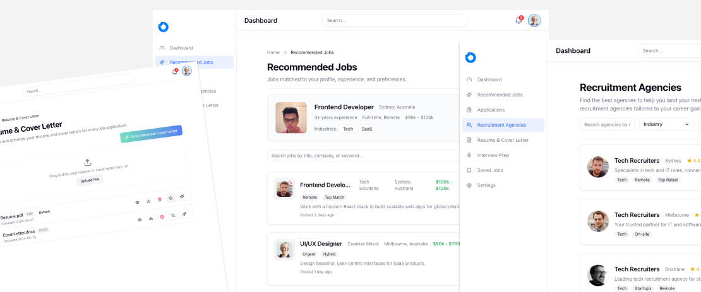

# ApplyEasy

**A modern, AI-powered job search platform built with Next.js 15 and React 19**

ApplyEasy reimagines the job search experience through intelligent recommendations and a meticulously crafted user interface. Built as a comprehensive frontend application, it eliminates the friction of traditional job boards like Seek, Indeed, or LinkedIn by delivering personalized job matches with advanced filtering capabilities.



## Overview

ApplyEasy is a production-ready frontend application that demonstrates enterprise-level React patterns, performance optimization techniques, and modern UI/UX principles. The platform features sophisticated job matching algorithms (frontend implementation), advanced state management, and a component architecture designed for scalability.

## Architecture & Implementation

### **Core Features**

**Intelligent Job Discovery**
- Sophisticated filtering system with real-time search and debounced input optimization
- Advanced sorting mechanisms with multiple criteria support
- Dynamic job matching interface with animated state transitions
- Comprehensive agency directory with detailed profile modals

**Enterprise-Grade UI Components**
- Modular component architecture following atomic design principles
- Custom design system built on Tailwind CSS with consistent spacing, typography, and color tokens
- Accessible components following WCAG 2.1 AA guidelines
- Responsive layouts optimized for mobile-first development

**Performance & UX Optimization**
- Skeleton loading states for perceived performance enhancement
- Lazy loading implementation for images and non-critical components
- Optimistic UI updates for improved user feedback
- Strategic pagination with infinite scroll capabilities

### **Technical Implementation**

**Frontend Architecture**
- Next.js 15 App Router with file-system based routing and nested layouts
- React Server Components for optimal performance and SEO
- TypeScript implementation with strict mode and comprehensive type coverage
- Custom hooks for business logic abstraction and reusability

**State Management & Forms**
- React Hook Form with Zod schema validation for type-safe form handling
- Controlled component patterns for complex form interactions
- Efficient re-rendering strategies using React.memo and useMemo
- Context API for global state management where appropriate

**Styling & Animation**
- Tailwind CSS 4 with custom configuration and design tokens
- shadcn/ui component library with custom theme extensions
- Framer Motion for sophisticated animations and page transitions
- CSS-in-JS patterns for dynamic styling based on component state

---

## Technology Stack

**Frontend Framework**
- Next.js 15 with App Router and React Server Components
- React 19 with concurrent features and automatic batching
- TypeScript 5+ with strict configuration and advanced type patterns

**UI & Styling**
- Tailwind CSS 4 with custom design system implementation
- shadcn/ui component library with extensive customization
- Radix UI primitives for accessible, unstyled components
- Framer Motion for production-grade animations and transitions

**Developer Experience**
- React Hook Form with Zod for robust form validation and type safety
- ESLint with custom rules and Prettier for code quality
- Husky and lint-staged for automated pre-commit hooks

---

## Getting Started

### Prerequisites
- Node.js 18+ with npm/yarn
- Modern browser with ES2022 support

### Installation & Development

```bash
git clone https://github.com/your-username/apply-easy.git
cd apply-easy
npm install
npm run dev
```

Visit `http://localhost:3000` to view the application.

### Production Build

```bash
npm run build
npm run start
```

---

## Project Structure

```
apply-easy/
├── app/                    # Next.js App Router
│   ├── (routes)/          # Route groups
│   ├── components/        # Route-specific components
│   └── globals.css       # Global styles
├── components/            # Shared UI components
│   ├── ui/               # Design system components
│   ├── forms/            # Form components
│   └── layout/           # Layout components
├── hooks/                # Custom React hooks
├── lib/                  # Utilities and configurations
├── types/                # TypeScript definitions
└── public/               # Static assets
```

---

<div align="center">

**ApplyEasy**

*Production-ready job search platform showcasing modern React architecture*

[Live Demo](#) • [LinkedIn](#) • [Portfolio](#)

Built with Next.js 15, React 19, and TypeScript

</div>
